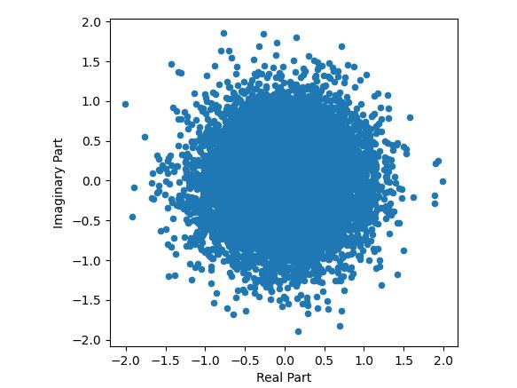
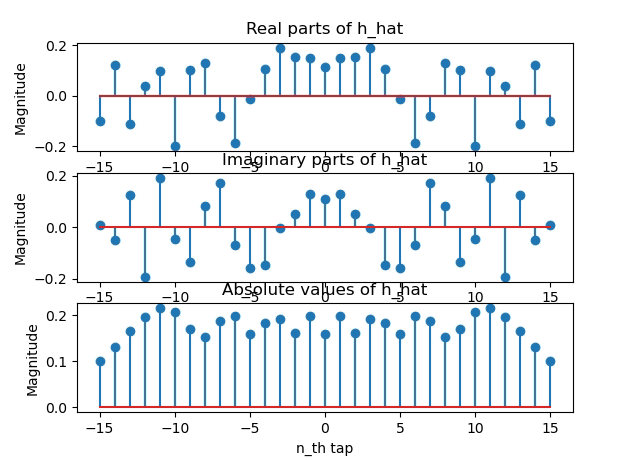

# Chromatic Dispersion Compensation using a Custom Convolution Layer

The purpose of this repository is to present a method for chromatic dispersion compensation in coherent optical communications systems, by using a custom convolution layer based on the filter proposed in the paper "Optimal Least-Squares FIR Digital Filters for Compensation of Chromatic Dispersion in Digital Coherent Optical Receivers" -  http://dx.doi.org/10.1109/JLT.2014.2307916.

**The optical communication chain composition**

THe emitter side of the chain contains a data generator, a data modulator, an upsampler and a Squared Root Raised Cosine Filter. The channels adds noise and chromatic dispersion to the transmitted signal. In the receiver side there is the filter proposed by the paper, a transient remover for removing the filter's delays, a downsampler, and a data demodulator. The output data will be compared to the input data so that Bit Error Rate is computed for performance monitoring. The parameters are the following: sample frequency = 21.4GHz, over sampling factor = 2, fiber's chromatic dispersion parameter = 17-e3, the wavelength = 1553 nm, the fiber's length = 4km. The signal to noise ratio is 20dBm.  

**The data is transmitted using a M-QAM modulation type. The received constellation in an ideal environment is given below** 

**The effect of the Chromatic Dispersion on the received constellation**

**The optimized filter for compensating the Chromatic Dispersion**

